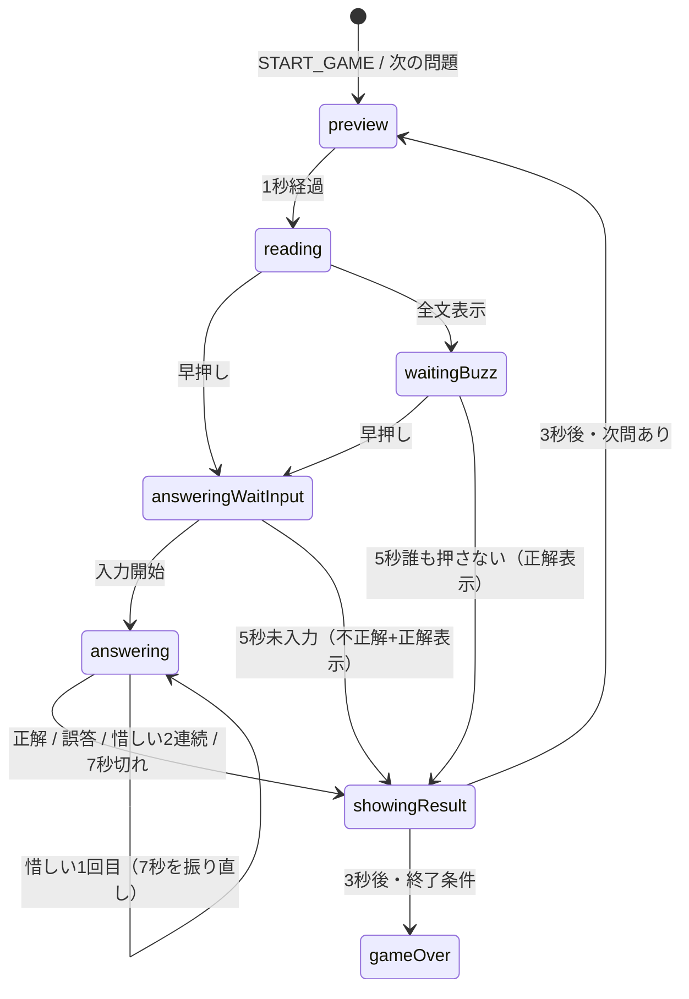

# ゲーム状態機械（game-core）

`packages/game-core` は React 非依存の TypeScript パッケージ。ゲーム規則の正本。

## 公開面

```ts
interface Clock {
  now(): number;
}

type PlayerIntent =
  | { type: "START_GAME"; settings: GameSettings; players: PlayerConfig[] }
  | { type: "BUZZ" }
  | { type: "ANSWER_INPUT"; value: string }
  | { type: "ANSWER_SUBMIT" }
  | { type: "TICK" };

class GameEngine {
  constructor(clock: Clock, questions: Question[]);
  dispatch(playerId: string, intent: PlayerIntent): void;
  getState(): Readonly<GameState>;
  getView(now?: number): GameView;
}
```

`GameState` は還元用の正本。`GameView` は UI 向けの派生値（可視文字、ゲージ比率、ボタン可否、問題文を出してよいか）。

## 定数（playtest で変更しやすい場所に置く）

| 名前 | 初期値 | 意味 |
| --- | --- | --- |
| `PREVIEW_MS` | 1000 | 第 n 問表示 |
| `CHARS_PER_SECOND.slow` | 6 | 文字送り（仮） |
| `CHARS_PER_SECOND.normal` | 10 | 文字送り（仮） |
| `CHARS_PER_SECOND.fast` | 16 | 文字送り（仮） |
| `DEFAULT_REVEAL_SPEED` | `normal` | MVP はこれのみ使用 |
| `ANSWER_START_MS` | 5000 | 入力開始期限 |
| `ANSWER_SUBMIT_MS` | 7000 | 確定期限 |
| `NO_BUZZ_MS` | 5000 | 全文表示後の早押し待ち |
| `RESULT_MS` | 3000 | 正解／一人練習の誤答結果 |
| `MAX_QUESTIONS_PER_GAME` | 100 | システム上限 |
| `MAX_PLAYERS` | 16 | システム上限 |
| `RECENT_AVOID_N` | 100 | 将来の出題回避。今は未使用 |
| `CLOSE_LIMIT` | 2 | 連続惜しいで不正解 |

文字/秒は仮。プレイテストで変える。コード上は定数オブジェクト以外に速度を埋め込まない。

## ゲーム全体の状態

```text
idle → inQuestion → gameOver
```

`inQuestion` の中に問題フェーズを持つ。最終問題も特別扱いしない。終了条件を満たしたら `gameOver`。

## 問題フェーズ



### preview

- 第 n 問を表示する時間
- 問題文なし
- 早押し不可
- 期限: `startedAt + PREVIEW_MS`

### reading

- 問題文を 1 文字ずつ表示
- 可視文字数は経過時間から計算する。1 文字ずつ `setInterval` しない
- 早押し可能
- 本文表示あり

```text
visibleCount = min(
  length,
  committedCount + floor((now - segmentStartedAt) * charsPerSecond / 1000)
)
```

早押しで一時停止するときは `committedCount = visibleCount`。再開時は `segmentStartedAt = now`。

### waitingBuzz

- 全文表示済み
- 早押し可能
- 本文表示あり（[spec-issues.md](spec-issues.md) 項目 4）
- 期限: `NO_BUZZ_MS`
- 誰も押さなければ `showingResult`（outcome=`unanswered`）。正解を 3 秒表示してから次へ

### answeringWaitInput

- 本文を完全非表示
- 回答権者だけ入力可
- 早押しボタン無効
- 5 秒以内に入力開始。未入力なら不正解
- ゲージは `deadlineAt - now`

### answering

- 本文非表示
- 1 文字（または IME composition）開始時点で 7 秒ゲージを新規開始
- Enter で確定
- 惜しい: 「言い直してください」。入力をクリアし、7 秒を新規開始。連続 2 回で不正解
- 誤答または 7 秒切れ: 不正解

### showingResult

次の問題へ進む前は、いかなる場合でもこのフェーズを通る。期限は `RESULT_MS`（3 秒）。

| outcome | 本文 | 正解 | 得点 |
| --- | --- | --- | --- |
| correct | 全文 | 表示 | 加算 |
| incorrect | 全文（一人練習） | 表示 | ペナルティがあれば減点 |
| unanswered | 全文 | 表示 | 変化なし |

回答中は本文を出さない。結果表示中は全文と正解を出してよい。

### incorrect からの分岐（showingResult に入る前）

誤答戦略で分岐する。一人練習はロックアウトしない。

| strategy | 動作 |
| --- | --- |
| `resumeFromBuzzPosition` | 誤答者をこの問題でロック。本文を押下位置から再開。他者は押せる |
| `endQuestion` | 問題を終了して結果表示。一人練習デフォルト |
| `noOneElse` | 誤答者をロック。本文は再開せず、未ロック者は同じ位置のまま早押し可 |
| `rereadFromStart` | 誤答者をロックし、本文を先頭から読み直す。上限超過で終了 |
| `nextFastest` | 同一問題の押下順キューの次の人だけに解答権。キューが尽きたら終了 |

ロックされたプレイヤーは、その問題では `BUZZ` を無視する。

### unanswered

誰も押さなかった。正解表示なし。次問へ。

## 早押し

- デフォルトキーは Space。キー自体は UI 設定。core は `BUZZ` intent だけ見る
- 画面ボタンも同じ intent
- `canBuzz` が false のとき UI はボタンを disabled にする。core も無視する
- 押下時刻は `clock.now()`
- 押下位置は当時の `visibleCount`（0 始まり。まだ 0 文字なら 0）
- 複数人は `atSynced` 昇順。完全同着は `seatIndex` 昇順
- 対戦では押した全員の名前と押下時間を view に含める（押し負け確認用）
- ロック確定後に届いた早押しでも、ロック時点より早い同期時刻なら受け入れる（後続の対戦用。Phase 1 は一人なので実質不要）

## 回答入力

許可:

- ひらがな（濁点・半濁点・小書きを含む）
- 英字（表示・保持は小文字）
- 数字
- 長音 `ー`

禁止:

- 漢字
- カタカナ（長音以外）
- その他記号・空白（入力段階で弾く）

正規化（判定用）:

1. NFKC
2. 英字小文字
3. カタカナ → ひらがな（正解データ側）
4. 空白除去
5. 許可文字以外は不正な入力

フロントは英字を小文字化する。core / サーバーも同じ関数で検証する。

## 正解判定

1 問に正解を複数持てる。惜しい回答も複数持てる。

判定順:

1. 正規化後、正解のいずれかと一致 → 正解
2. 惜しいのいずれかと一致 → 惜しい
3. それ以外 → 誤答

表記揺れは正規化で吸収する（`ATP` / `atp`）。意味の違う別表記は別正解として登録する（`しんじゅ` と `ぶたにしんじゅ`）。

## 得点と勝利

- 開始時 0
- 正解点は 1 以上
- 誤答ペナルティは `none` または 1 以上の減点
- 先取制: 指定点に到達した人が勝ち。同時到達は同率優勝
- 競走制: 指定問題数終了時の点で順位。同率許可
- 途中参加は MVP 対象外
- 途中退出は脱落。詳細履歴は後で決める。状態上は `withdrawn` フラグだけ用意する

## 問題数

設定可能。上限 100。下限 1。

## プレイヤー

- 一人練習: 1 人
- 対戦: 2..16
- ゲーム開始後の参加は Phase 1 対象外

## 問題選出

```ts
interface QuestionSelector {
  select(ctx: SelectContext): Question;
}
```

Phase 1 は `RandomSelector`。同じゲーム内での重複可否は設定で後から足す。今は重複なしシャッフルで足りる（100 問上限）。

## テストが守る不変条件

- preview 中は `canBuzz === false` かつ本文なし
- reading / waitingBuzz のみ本文あり
- answering* は本文なし
- ゲージは deadline から計算され、interval カウンタを持たない
- 惜しい 2 連続は incorrect
- 最終問題も `RESULT_MS` を経てから `gameOver`
- 偽時計を進めても、飛ばした期限は `tick` で処理される
